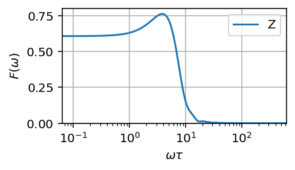

# `filter_functions`: A package for efficient numerical calculation of generalized filter functions
[](https://codecov.io/gh/qutech/filter_functions)
[](https://travis-ci.org/qutech/filter_functions)
[](https://filter-functions.readthedocs.io/en/latest/?badge=latest)
[](https://badge.fury.io/py/filter-functions)

## Introduction
Simply put, filter functions characterize a quantum system's susceptibility to noise at a given frequency during a control operation and can thus be used to gain insight into its decoherence. The formalism allows for efficient calculation of several quantities of interest such as average gate fidelity and even the entire quantum process up to a unitary rotation. Moreover, the filter function of a composite pulse can be easily derived from those of the constituent pulses, allowing for efficient assembly and characterization of pulse sequences.

Previously, filter functions have only been computed analytically for select pulses such as dynamical decoupling sequences [1, 2]. With this project we aim to provide a toolkit for calculating and inspecting filter functions for arbitrary pulses including pulses without analytic form such as one might get from numerical pulse optimization algorithms.

The `filter_functions` package is built to interface with [QuTiP](http://qutip.org/), a widely-used quantum toolbox for Python, and comes with extensive documentation and a test suite. Note that the project is still in pre-release and thus liable to breaking API changes.

As a very brief introduction, consider a Hadamard gate implemented by a pi/2 Y-gate followed by a NOT-gate using simple square pulses. We can calculate and plot the dephasing filter function of the gate with the following code:

```python
import filter_functions as ff
import qutip as qt
from math import pi

H_c = [[qt.sigmax()/2,   [0, pi], 'X'],
       [qt.sigmay()/2, [pi/2, 0], 'Y']]     # control Hamiltonian
H_n = [[qt.sigmaz()/2,    [1, 1], 'Z']]     # constant coupling to z noise
dt = [1, 1]                                 # time steps

hadamard = ff.PulseSequence(H_c, H_n, dt)   # Central object representing a control pulse
omega = ff.util.get_sample_frequencies(hadamard)
F = hadamard.get_filter_function(omega)

from filter_functions import plotting
plotting.plot_filter_function(hadamard)     # Filter function cached from before
```



An alternative way of obtaining the Hadamard `PulseSequence` is by concatenating the composing pulses:

```python
Y2 = ff.PulseSequence([[qt.sigmay()/2, [pi/2], 'Y']],
                      [[qt.sigmaz()/2,    [1], 'Z']],
                      [1])
X = ff.PulseSequence([[qt.sigmax()/2, [pi], 'X']],
                     [[qt.sigmaz()/2,  [1], 'Z']],
                     [1])

Y2.cache_filter_function(omega)
X.cache_filter_function(omega)

hadamard = Y2 @ X           # equivalent: ff.concatenate((Y2, X))
hadamard.is_cached('filter function')
# True  (filter function cached during concatenation)
```

To compute, for example, the infidelity of the gate in the presence of an arbitrary classical noise spectrum, we can simply call `infidelity()`:

```python
spectrum = 1e-2/abs(omega)
infidelity = ff.infidelity(hadamard, spectrum, omega)
# array([0.006037])  (one contribution per noise operator)
```

## Installation
To install the package from PyPI, run `pip install filter_functions`. If you require the optional features provided by QuTiP (visualizing Bloch sphere trajectories), it is recommended to install QuTiP before by following the [instructions on their website](http://qutip.org/docs/latest/installation.html) rather than installing it through `pip`. To install the package from source run `python setup.py develop` to install using symlinks or `python setup.py install` without.

To install dependencies of optional extras (`requests` for a fancy progress bar in Jupyter notebooks, `matplotlib` for plotting, `QuTiP` for Bloch sphere visualization), run `pip install -e .[extra]` where `extra` is one or more of `fancy_progressbar`, `plotting`, `bloch_sphere_visualization` from the root directory. To install all dependencies, including those needed to build the documentation and run the tests, use the extra `all`.

## Documentation
You can find the documentation on [Readthedocs](https://filter-functions.readthedocs.io/en/latest/). It is built from Jupyter notebooks that can also be run interactively and are located [here](doc/source/examples). The notebooks explain how to use the package and thus make sense to follow chronologically as a first step. Furthermore, there are also a few example scripts in the [examples](examples) folder.

The documentation including the example notebooks and an automatically generated API documentation can be built by running `make <format>` inside the *doc* directory where `<format>` is for example `html`.

Interactively using the documentation requires `jupyter`, and building a static version additionally requires `nbsphinx`, `numpydoc`, `sphinx_rtd_theme`, as well as `pandoc`. The last can be installed via conda (`conda install pandoc`) or downloaded from [Github](https://github.com/jgm/pandoc/releases/) and the rest automatically by running `pip install -e .[doc]`.

## References
[1]: Cywinski, L., Lutchyn, R. M., Nave, C. P., & Das Sarma, S. (2008). How to enhance dephasing time in superconducting qubits. Physical Review B - Condensed Matter and Materials Physics, 77(17), 1–11. [https://doi.org/10.1103/PhysRevB.77.174509](https://doi.org/10.1103/PhysRevB.77.174509)

[2]: Green, T. J., Sastrawan, J., Uys, H., & Biercuk, M. J. (2013). Arbitrary quantum control of qubits in the presence of universal noise. New Journal of Physics, 15(9), 095004. [https://doi.org/10.1088/1367-2630/15/9/095004](https://doi.org/10.1088/1367-2630/15/9/095004)
